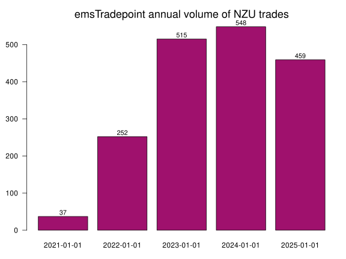
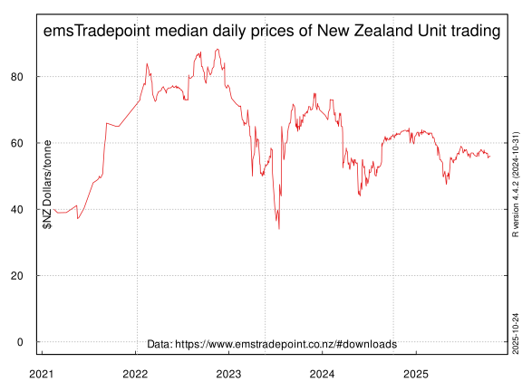

## emsTradepoint NZU prices

The energy trading company [emsTradepoint](https://www.emstradepoint.co.nz) hosts csv files of recent New Zealand Unit (NZU) prices from trading on it's brokering service.

It has made 1,672 trades since 17 February 2021.
 

#### Trades data file in csv format
* [uniquetrades](uniquetrades.csv) NZU prices including multiple trades daily at different prices

#### Chart of NZU trading at emsTradepoint

#### Daily median prices of trades data file in csv format
* [dailymedianprices](dailymedianprices.csv) median daily NZU prices (one price/day)

#### Chart of daily median prices

#### emsTradepoint NZU indices ECMI monthly, ECQI quarterly, VWAP volume weighted average price
* [ECMI_ECQI_15_01_24](ECMI_ECQI_15_01_24.csv) 

#### Chart of emsTradepoint NZU indices

